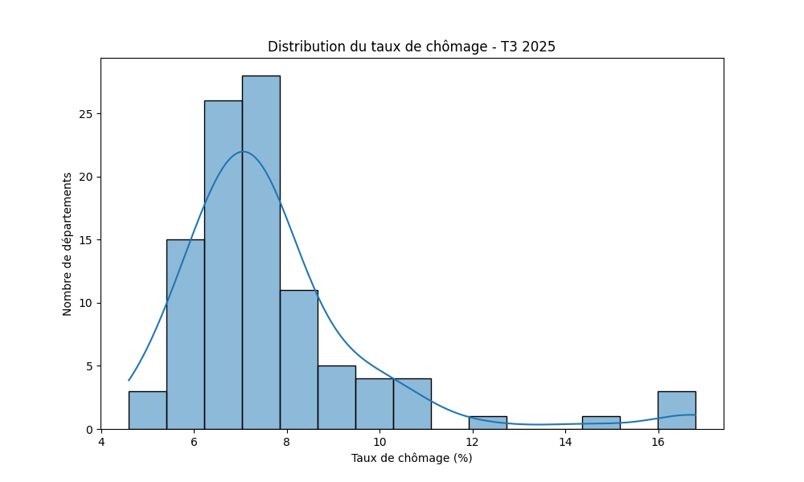
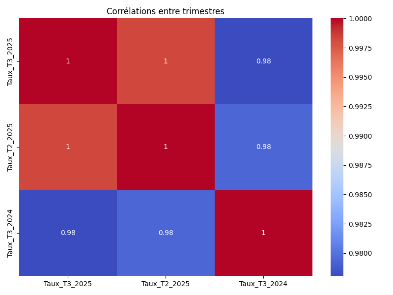

# Analyse du taux de chômage par département – T3 2025

## Objectif
Ce projet vise à analyser le **taux de chômage par département en France** pour le 3ᵉ trimestre 2025 à partir des données publiques INSEE.  
L'objectif est de **transformer des données brutes en insights exploitables** et de produire des visualisations claires pour soutenir la décision.

## Dataset
- Source : INSEE – [Taux de chômage localisés au 3ᵉ trimestre 2025](https://www.insee.fr/fr/statistiques/2012804)  
- Fichier principal : `data/raw/TCRD_025.xlsx`  
- Fichier nettoyé utilisé pour l'analyse : `data/cleaned/chomage_departements_clean.csv`  
- Contient les taux de chômage par département pour T3 2025, T2 2025 et T3 2024.

## Outils
- **Python**  
  - pandas, numpy  
  - matplotlib, seaborn  
- Jupyter Notebook (`01_analysis.ipynb`)  

## Méthodologie
1. **Nettoyage des données** : conversion des valeurs en float, suppression des lignes vides, renommage des colonnes  
2. **Analyse exploratoire** : statistiques descriptives, comparaison entre départements  
3. **Visualisations** :  
   - Bar chart du T3 2025 par département  
   - Histogramme de distribution des taux  
   - Évolution des taux par département sur 3 trimestres  
   - Heatmap de corrélation  
4. **Insights / conclusion** : identification des départements à surveiller ou en amélioration.

## Visualisations

### Bar Chart – Taux de chômage par département

### Histogramme – Distribution des taux

### Évolution par trimestre

### Corrélations entre trimestres

## Insights clés
- Les départements avec un taux de chômage supérieur à la moyenne nationale peuvent nécessiter des mesures spécifiques.  
- Certains départements sont en amélioration par rapport aux trimestres précédents, indiquant une dynamique positive.  
- La visualisation permet de **comparer rapidement les départements et détecter les tendances**.  

---

Ce projet montre comment **analyser un dataset public, produire des visualisations claires et extraire des insights exploitables**, compétences essentielles pour un rôle de Data Analyst.
