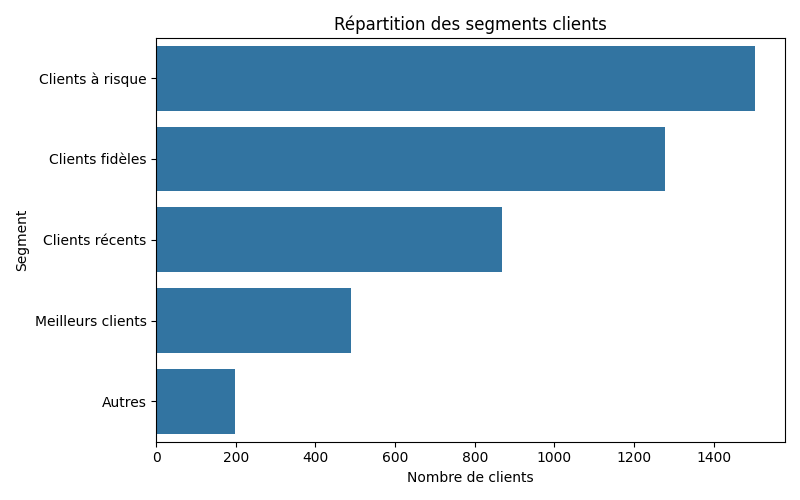
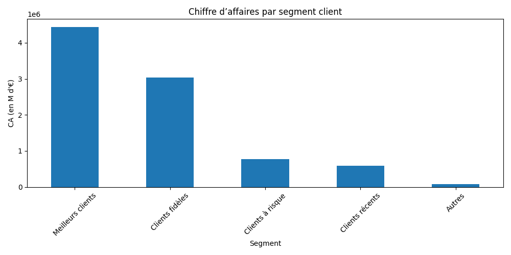
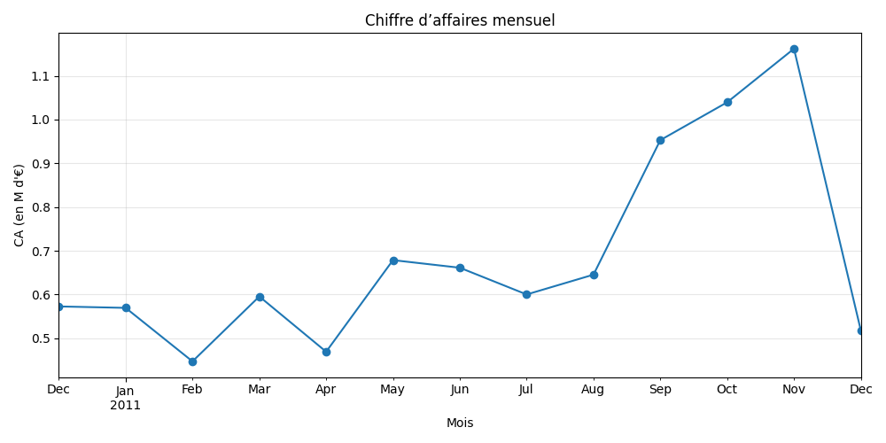

# Analyse clients et segmentation RFM – Online Retail

## Objectif
Ce projet vise à analyser les transactions clients d’un site e-commerce (dataset **Online Retail**) afin de comprendre le comportement des clients, segmenter la clientèle via la méthode **RFM (Recency, Frequency, Monetary)**, et produire des visualisations claires pour soutenir la décision marketing.

L’objectif est de transformer des données brutes en insights exploitables pour identifier les **meilleurs clients**, les clients **fidèles**, et ceux **à risque**, afin d’optimiser les stratégies marketing et la fidélisation.

---

## Dataset
- **Source :** [UCI Machine Learning Repository – Online Retail](https://archive.ics.uci.edu/ml/datasets/Online+Retail)  
- **Fichier principal :** `data/raw/Online_Retail.xlsx`  
- **Fichier nettoyé utilisé pour l’analyse :** `data/online_retail_cleaned.csv`  
- Contient plus de 500 000 transactions avec :
  - `InvoiceNo` : numéro de commande  
  - `StockCode` : code produit  
  - `Description` : description produit  
  - `Quantity` : quantité commandée  
  - `InvoiceDate` : date de la commande  
  - `UnitPrice` : prix unitaire  
  - `CustomerID` : identifiant client  
  - `Country` : pays  

---

## Outils
- **Python**  
- Librairies : `pandas`, `numpy`, `matplotlib`, `seaborn`, `openpyxl`  
- Jupyter Notebook : `analyse_ventes.ipynb`

---

## Méthodologie
1. **Nettoyage des données**
   - Suppression des doublons et valeurs manquantes  
   - Calcul du prix total par ligne (`TotalPrice = Quantity * UnitPrice`)  
   - Création de la colonne `Month` pour l’analyse mensuelle  

2. **Analyse RFM**
   - **Recency (R)** : nombre de jours depuis le dernier achat  
   - **Frequency (F)** : nombre de commandes  
   - **Monetary (M)** : montant total dépensé  
   - Attribution de scores R, F, M via des quartiles  
   - Calcul du **RFM_Score** et segmentation des clients :  
     - Meilleurs clients  
     - Clients fidèles  
     - Clients récents  
     - Clients à risque  

3. **Visualisations**
   - Répartition des clients par segment  
   - Chiffre d’affaires par segment  
   - Chiffre d’affaires mensuel  

---

## Visualisations

| Graphique | Description |
|-----------|------------|
|  | Répartition des segments clients |
|  | Chiffre d’affaires par segment client |
|  | Chiffre d’affaires mensuel |

---

## Insights clés
- Une minorité de clients génère une part importante du chiffre d’affaires  
- Les **meilleurs clients** doivent être fidélisés via des offres personnalisées  
- Les **clients à risque** peuvent être ciblés pour des campagnes de réactivation  
- La segmentation RFM permet d’optimiser les stratégies marketing et prioriser les actions  

---

Ce projet montre comment analyser un dataset transactionnel, produire des visualisations claires et extraire des insights exploitables, compétences essentielles pour un rôle de **Data Analyst / Marketing Analyst**.
