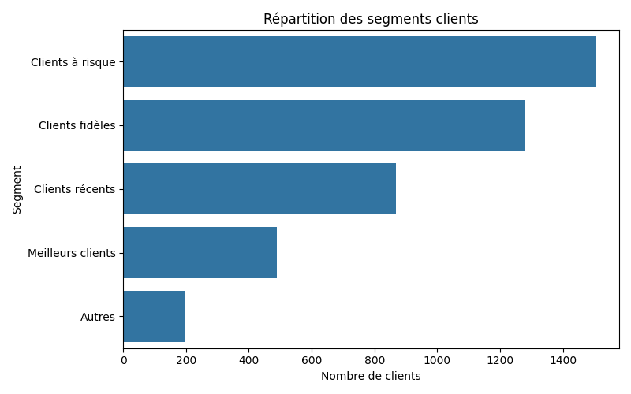
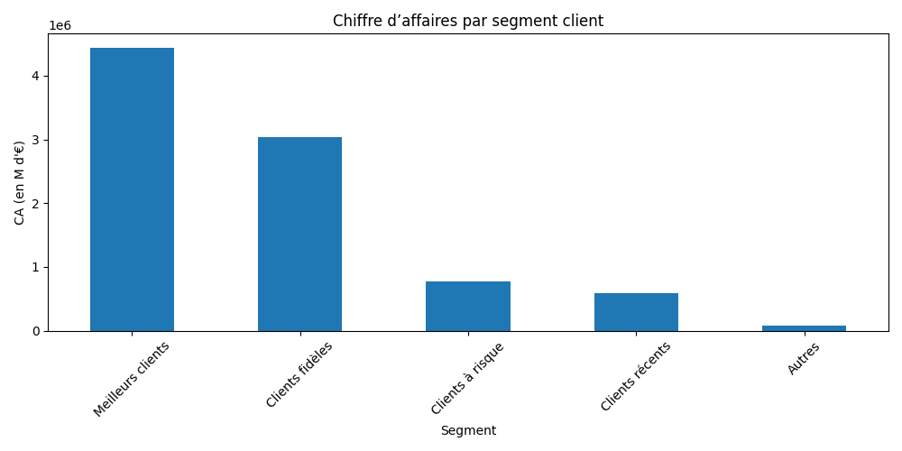
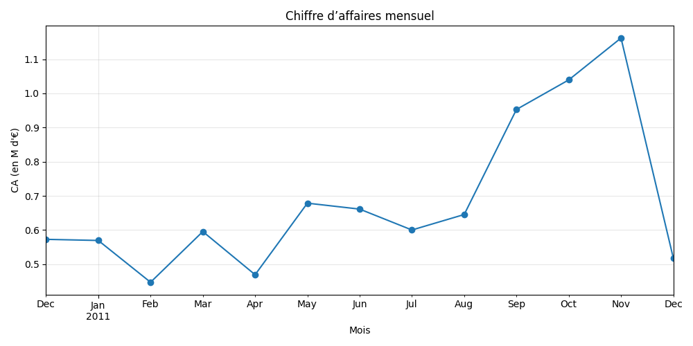

# Customer Analysis and RFM Segmentation – Online Retail

## Objective

This project analyzes customer transactions from an e-commerce dataset (**Online Retail**) to understand customer behavior, segment customers using the **RFM (Recency, Frequency, Monetary)** methodology, and create clear visualizations to support data-driven decision-making.

The goal is to turn raw data into actionable insights to identify **top customers**, **loyal customers**, and **at-risk customers**, in order to optimize marketing and customer retention strategies.

---

## Dataset

- **Source:** [UCI Machine Learning Repository – Online Retail](https://archive.ics.uci.edu/ml/datasets/Online+Retail)
- **Raw dataset:** `data/raw/Online_Retail.xlsx`
- **Cleaned dataset used for the analysis:** `data/online_retail_cleaned.csv`
- Contains more than 500,000 transactions with:
  - `InvoiceNo`: invoice number
  - `StockCode`: product code
  - `Description`: product description
  - `Quantity`: quantity purchased
  - `InvoiceDate`: invoice date
  - `UnitPrice`: unit price
  - `CustomerID`: customer identifier
  - `Country`: country

---

## Tools

- **Python**
- Libraries: `pandas`, `numpy`, `matplotlib`, `seaborn`, `openpyxl`
- Jupyter Notebook: `analyse_ventes.ipynb`

---

## Methodology

1. **Data cleaning**
   - Removal of duplicates and missing values
   - Calculation of the total price per transaction line (`TotalPrice = Quantity * UnitPrice`)
   - Creation of the `Month` column for monthly analysis

2. **RFM analysis**
   - **Recency (R):** number of days since the customer's last purchase
   - **Frequency (F):** number of orders placed
   - **Monetary (M):** total amount spent
   - Assignment of R, F, and M scores using quartiles
   - Calculation of the **RFM_Score** and customer segmentation into:
     - Top customers
     - Loyal customers
     - Recent customers
     - At-risk customers

3. **Visualizations**
   - Customer distribution by segment
   - Revenue by customer segment
   - Monthly revenue

---

## Visualizations

| Chart | Description |
|-----------|------------|
|  | Customer segment distribution |
|  | Revenue by customer segment |
|  | Monthly revenue |

---

## Key Insights

- A small proportion of customers generates a significant share of total revenue.
- **Top customers** should be retained through personalized offers and loyalty strategies.
- **At-risk customers** can be targeted through reactivation campaigns.
- RFM segmentation helps optimize marketing strategies and prioritize customer retention actions.

---

This project demonstrates how to **analyze transactional data, create clear visualizations, and extract actionable insights**, key skills for a **Data Analyst / Marketing Analyst** role.
