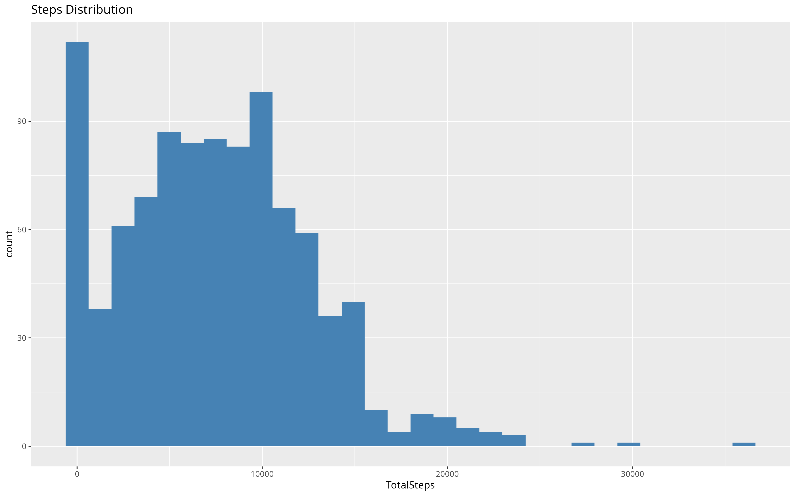
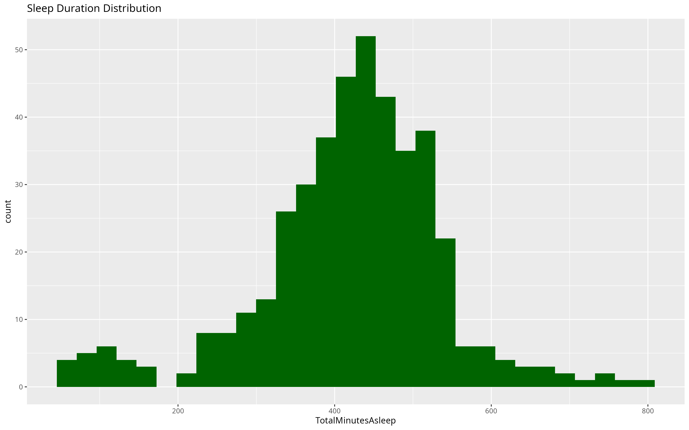
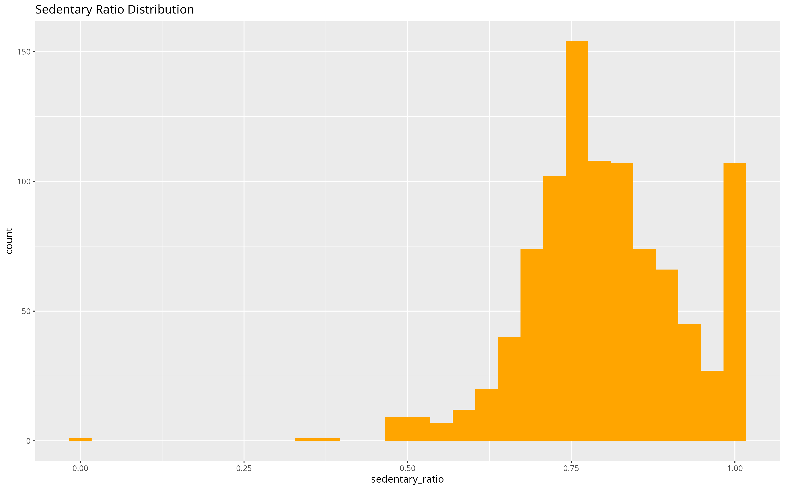

# Bellabeat Smart Device Usage Analysis

## Project Overview

This project analyzes non-Bellabeat smart device usage data to identify behavioral trends and translate them into strategic marketing recommendations for Bellabeat.

The objective is to understand how consumers use fitness tracking devices and determine how these insights can support the growth and positioning of the Bellabeat Leaf product.

---

## Business Context

Bellabeat is a wellness technology company focused on women’s health.  
The company aims to expand its market share in the global smart device market.

To support this objective, the marketing analytics team must analyze consumer smart device usage patterns and transform behavioral insights into actionable marketing strategies.

---

## Business Task

Analyze non-Bellabeat smart device usage data in order to:

- Identify key behavioral trends in activity and sleep tracking  
- Understand user engagement and tracking consistency  
- Translate these behavioral insights into strategic positioning for Bellabeat Leaf  

---

## Key Business Questions

1. What are the main trends in smart device usage ?  
2. How do users differ in terms of engagement and activity levels ?  
3. How can these behavioral patterns inform Bellabeat’s marketing strategy ?  

---

## Selected Product Focus

This analysis focuses on **Bellabeat Leaf**, a wellness tracker designed to monitor activity, sleep, and stress.

The FitBit dataset provides activity and sleep metrics that closely align with Leaf’s core functionalities. This makes it the most relevant Bellabeat product for strategic application of the findings.

---

# PREPARE

## Data Sources

This analysis uses the following public dataset:

[FitBit Fitness Tracker Data (Kaggle, CC0 Public Domain)](https://www.kaggle.com/datasets/arashnic/fitbit)

- Source: Mobius  
- 30 Fitbit users  
- Minute-level activity and sleep tracking  
- Includes daily steps, calories burned, active minutes, and sleep logs  

Two activity datasets covering two distinct time periods were downloaded and consolidated.  
One sleep dataset was available and used for sleep-related analysis.

---

## Data Structure

The dataset contains multiple CSV files.  
The primary files used in this analysis are:

- `dailyActivity_merged.csv` (two periods combined)  
- `sleepDay_merged.csv`  

These datasets include:

- User ID  
- Date  
- Activity metrics (steps, calories, active minutes, sedentary minutes)  
- Sleep duration  

---

## Data Storage & Organization

- Raw files stored in `/data/raw`  
- Consolidated datasets stored in `/data/processed`  
- Original files preserved without modification  

This structure ensures reproducibility and preserves data integrity.

---

## Data Relevance to Business Problem

The selected datasets directly align with the core functionalities of Bellabeat Leaf.

The analysis focuses on:

- Physical activity behavior  
- Sleep tracking consistency  
- User engagement patterns  

These variables enable behavioral segmentation, which is essential for defining targeted marketing strategies.

---

## Data Integrity Checks

Initial inspection included:

- Row count validation  
- Distinct user ID verification  
- Date range verification  
- Cross-dataset user consistency checks  
- Duplicate detection  

Detailed inspection results (row counts, user counts, and date coverage) are documented in the processing section of this project.

---

## Data Credibility & Limitations

Although the dataset is publicly available and structured, it presents several limitations:

- Small sample size (30 users)  
- No demographic variables (age, gender, income, etc.)  
- Data collected in 2016  
- Self-selected participants  
- Limited time coverage  

These constraints limit the generalizability of the findings but still allow meaningful behavioral trend exploration.

---

## Data Governance Considerations

- License: CC0 Public Domain  
- No personally identifiable information included  
- Stored locally in structured raw and processed folders  
- Original datasets preserved without alteration

---

# PROCESS / ANALYSIS

## Global Descriptive Statistics

The main descriptive statistics across all users:

| Metric                  | Mean    | Median  | Std Dev |
|-------------------------|---------|---------|---------|
| Total Steps             | 7,492   | 7,280   | 5,120   |
| Active Minutes          | 223     | -       | -       |
| Sedentary Ratio         | 0.802   | -       | -       |
| Total Sleep (minutes)   | 420     | -       | -       |
| Time in Bed (minutes)   | 459     | -       | -       |
| Calories                | 2,262   | -       | -       |

## Step, Sleep, and Sedentary Distributions

### Steps Distribution

### Sleep Duration Distribution

### Sedentary Ratio Distribution

## Weekday vs Weekend Comparison

| Period   | Mean Steps | Mean Sleep (min) | Mean Sedentary Ratio |
|----------|-----------|-----------------|--------------------|
| Weekday  | 7,472     | 414             | 0.804              |
| Weekend  | 7,551     | 436             | 0.797              |

## Segmentation by Activity Level

| Activity Level | Mean Sleep (min) | Mean Calories | Mean Sedentary Ratio | Count |
|----------------|----------------|---------------|--------------------|-------|
| Low            | 454            | 1,730         | 0.904              | 323   |
| Moderate       | 422            | 2,338         | 0.769              | 338   |
| High           | 396            | 2,744         | 0.730              | 303   |

## Statistical Insights

- ANOVA: Significant difference in sleep between activity levels (p < 0.001)  
- T-tests: No significant difference in steps or sleep between weekdays and weekends  
- Pearson correlation: Weak negative correlation between steps and sleep (r = -0.19)  
- Quartile analysis: Higher step quartiles are associated with lower sleep duration and higher calories burned  

## Linear Regression

- Multiple linear regression indicates that **steps, sedentary ratio, and calories** explain ~11% of variance in sleep duration  
- Calorie-free alternative model still shows steps and sedentary ratio as significant predictors  

> All raw and processed outputs, tables, and full model summaries are available in `/data/processed/output`