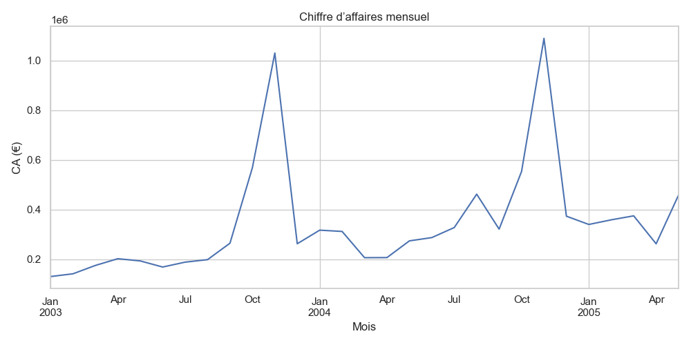
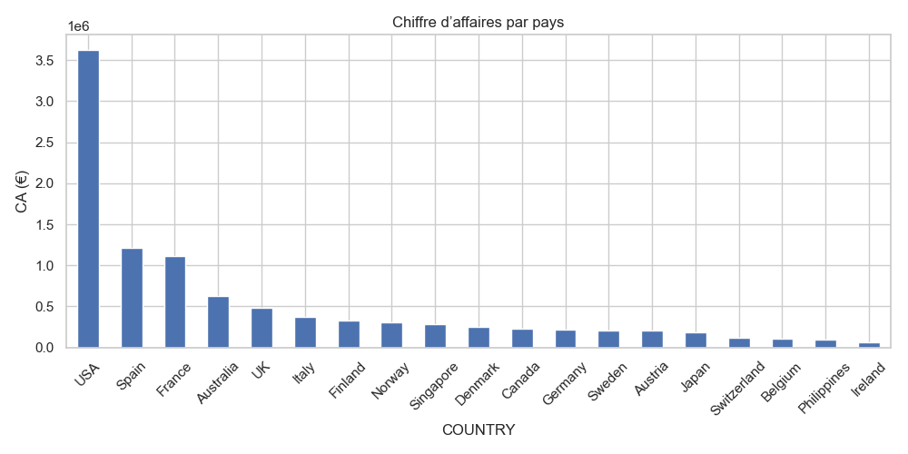
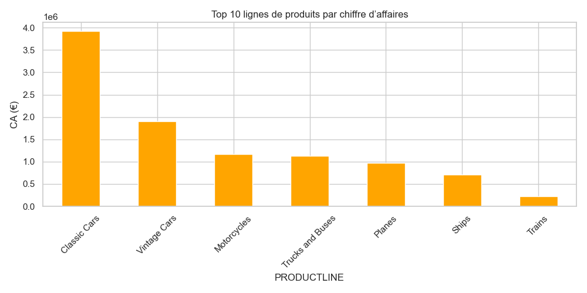
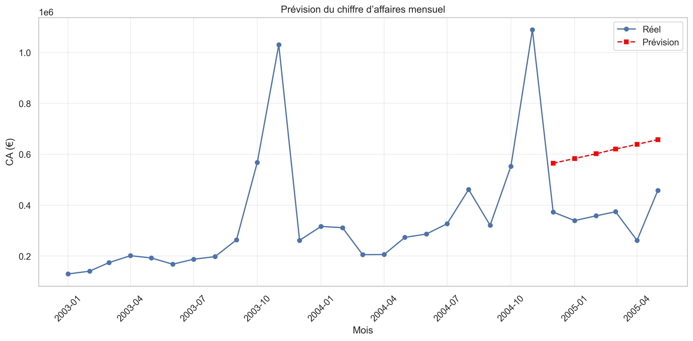

# Prévision du chiffre d’affaires mensuel – Store Item Demand Forecasting

## Objectif
Ce projet vise à analyser le chiffre d’affaires d’un site e-commerce et à réaliser une prévision simple du CA mensuel par magasin et produit.  
L'objectif est de transformer des données brutes en insights exploitables et de produire des visualisations claires pour soutenir la décision.

## Dataset
- Source : [Kaggle – Store Item Demand Forecasting](https://www.kaggle.com/competitions/store-item-demand-forecasting/data)
- Fichier principal : `data/raw/sales_data_sample.csv`
- Fichier nettoyé utilisé pour l'analyse : `data/cleaned/sales_data_cleaned.csv`
- Contenu : 2823 transactions avec informations sur commandes, clients, produits, quantités et ventes.

## Outils
- Python
- pandas, numpy
- matplotlib, seaborn
- scikit-learn
- Jupyter Notebook (`01_sales_forecasting.ipynb`)

## Méthodologie
1. **Nettoyage des données** : gestion des encodages, conversion des dates, création de colonnes calculées (`TotalPrice`, `Year`, `Month`, `YearMonth`).
2. **Analyse exploratoire** :  
   - CA total par mois  
   - CA par pays  
   - Top 10 lignes de produits
3. **Préparation pour la prévision** : agrégation par mois, création des datasets train/test (80/20)
4. **Modélisation** : régression linéaire simple
5. **Évaluation** : RMSE et MAE
6. **Visualisation des prévisions** : comparaison entre CA réel et prévisions
7. **Insights** : identification des tendances saisonnières et des produits/clients les plus performants

## Visualisations
- CA mensuel  
- CA par pays  
- Top 10 lignes de produits  
- Prévision du CA mensuel  

  
  
  

## Insights clés
- Certaines périodes montrent des pics de ventes (saisonnalité).  
- Les produits phares contribuent fortement au CA et doivent être mis en avant.  
- La régression linéaire simple permet de suivre la tendance générale, mais des modèles plus avancés (Random Forest, Prophet) pourraient améliorer les prévisions.  
- Ce projet montre comment passer de données brutes à des insights exploitables et des prévisions simples, compétences essentielles pour un rôle de Data Analyst.
