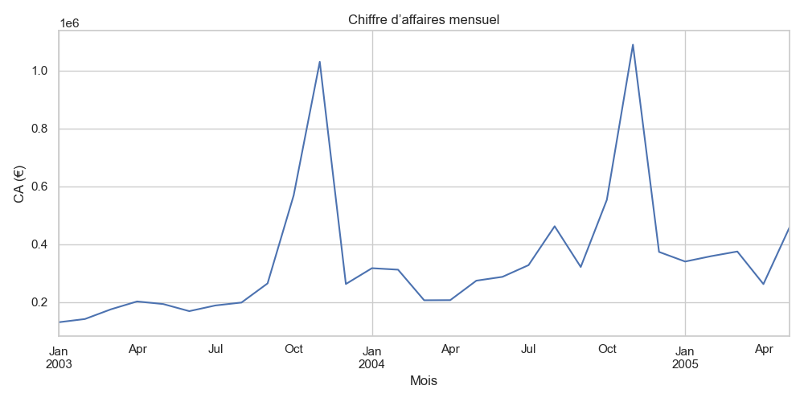
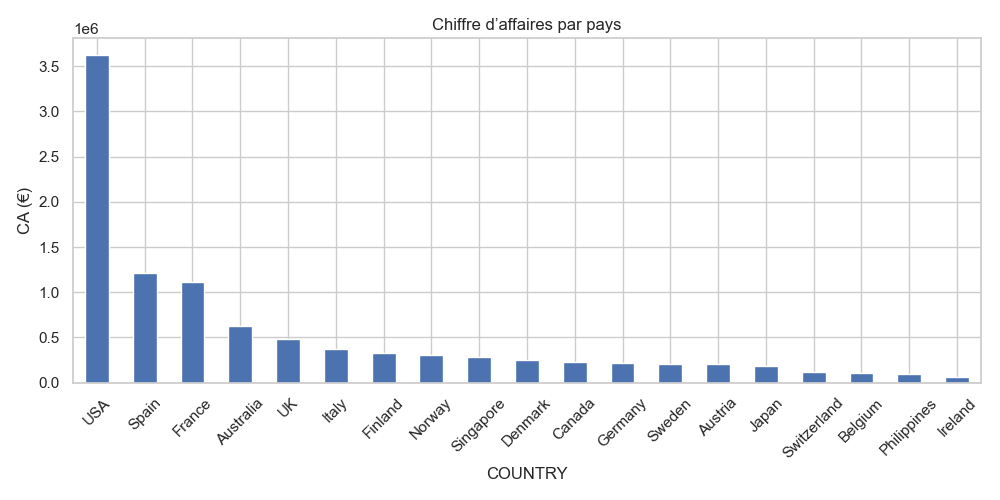
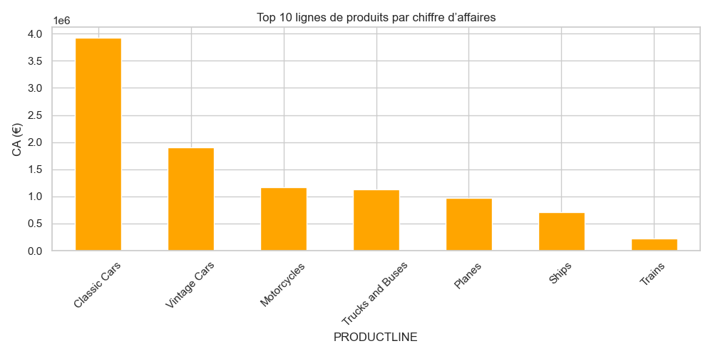
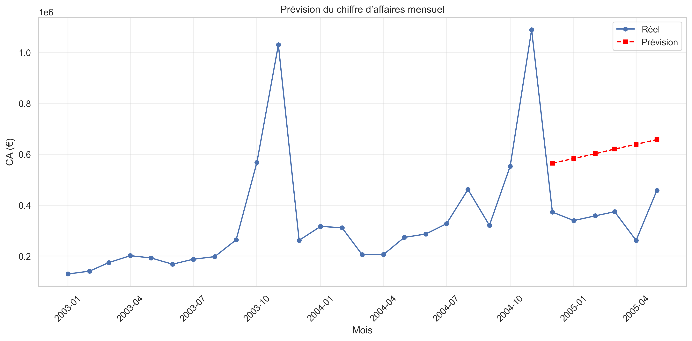

# Monthly Revenue Forecasting – Store Item Demand Forecasting

## Objective

This project analyzes e-commerce revenue and performs a simple monthly revenue forecast by store and product.

The goal is to turn raw data into actionable insights and produce clear visualizations to support data-driven decision-making.

## Dataset

- **Source:** [Kaggle – Store Item Demand Forecasting](https://www.kaggle.com/competitions/store-item-demand-forecasting/data)
- **Raw dataset:** `data/raw/sales_data_sample.csv`
- **Cleaned dataset used for the analysis:** `data/cleaned/sales_data_cleaned.csv`
- **Content:** 2,823 transactions containing information about orders, customers, products, quantities, and sales.

## Tools

- Python
- `pandas`, `numpy`
- `matplotlib`, `seaborn`
- `scikit-learn`
- Jupyter Notebook (`01_sales_forecasting.ipynb`)

## Methodology

1. **Data cleaning:** handling encodings, converting dates, and creating calculated columns (`TotalPrice`, `Year`, `Month`, `YearMonth`)
2. **Exploratory analysis:**
   - Total monthly revenue
   - Revenue by country
   - Top 10 product lines
3. **Forecasting preparation:** monthly aggregation and creation of train/test datasets (80/20 split)
4. **Modeling:** simple linear regression
5. **Evaluation:** RMSE and MAE
6. **Forecast visualization:** comparison between actual and predicted revenue
7. **Insights:** identification of seasonal trends and top-performing products and customers

## Visualizations

- Monthly revenue
- Revenue by country
- Top 10 product lines
- Monthly revenue forecast

  
  
  

## Key Insights

- Certain periods show sales peaks, indicating seasonal patterns.
- Top-performing products contribute significantly to overall revenue and should be prioritized in business strategies.
- Simple linear regression can capture the overall trend, but more advanced models such as Random Forest or Prophet could potentially improve forecasting performance.
- This project demonstrates how to move from **raw data to actionable insights and simple forecasting**, key skills for a Data Analyst role.
