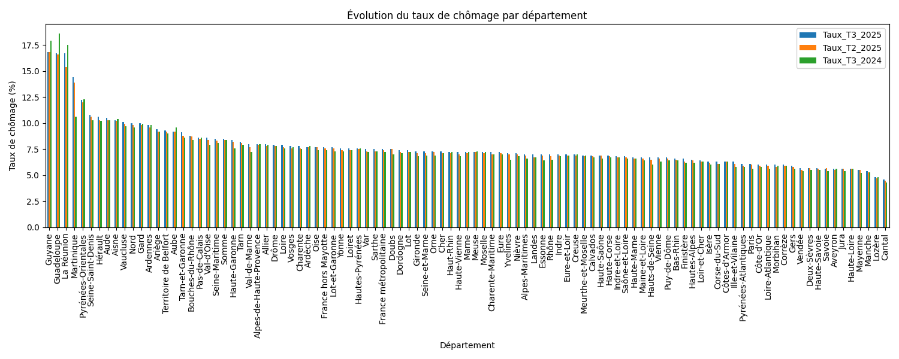
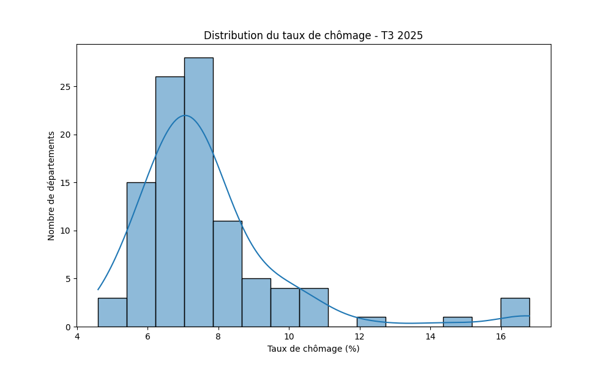
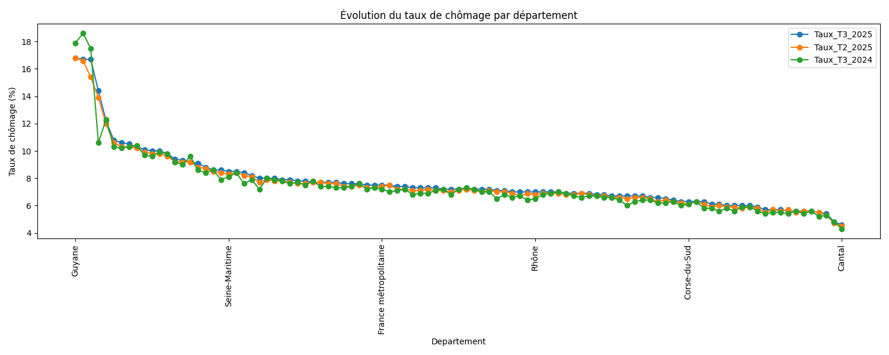
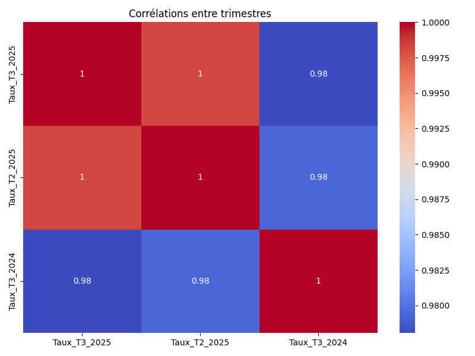

# Unemployment Rate Analysis by French Department - Q3 2025

## Objective

This project analyzes **unemployment rates across French departments** for Q3 2025 using publicly available INSEE data.

The goal is to **turn raw data into actionable insights** and produce clear visualizations to support data-driven decision-making.

## Dataset

- Source: INSEE – [Localized unemployment rates for Q3 2025](https://www.insee.fr/fr/statistiques/2012804)
- Raw dataset: `data/raw/TCRD_025.xlsx`
- Cleaned dataset used for the analysis: `data/cleaned/chomage_departements_clean.csv`
- Contains unemployment rates by department for Q3 2025, Q2 2025, and Q3 2024.

## Tools

- **Python**
  - pandas
  - numpy
  - matplotlib
  - seaborn
- Jupyter Notebook (`01_analysis.ipynb`)

## Methodology

1. **Data cleaning:** conversion of values to numeric format, removal of empty rows, and column renaming
2. **Exploratory analysis:** descriptive statistics and comparison across departments
3. **Data visualization:**
   - Bar chart of Q3 2025 unemployment rates by department
   - Distribution histogram
   - Unemployment rate trends by department across three quarters
   - Correlation heatmap
4. **Insights and conclusions:** identification of departments requiring attention and departments showing improvement

## Visualizations

### Bar Chart – Unemployment Rate by Department

### Histogram – Unemployment Rate Distribution

### Quarterly Trends

### Correlations Between Quarters

## Key Insights

- Departments with unemployment rates above the national average may require specific attention.
- Some departments show improvement compared with previous quarters, indicating positive trends.
- The visualizations make it possible to **quickly compare departments and identify trends**.

---

This project demonstrates how to **analyze a public dataset, create clear visualizations, and extract actionable insights** - key skills for a Data Analyst role.
